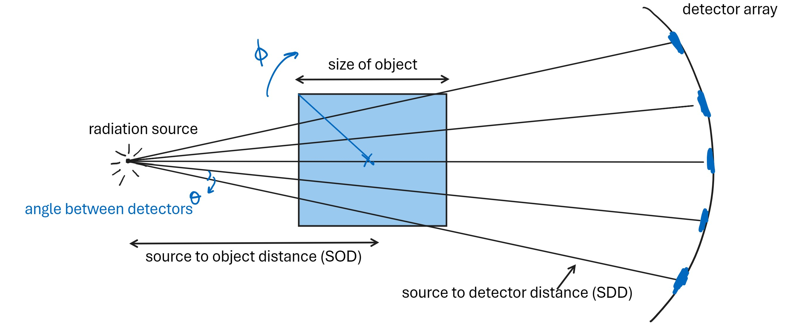

# CT 2D Image Reconstruction

This repository provides a Python-based implementation of Computed Tomography (CT) reconstruction for 2D images.

## Description

The task is to reconstruct the image of a sample from its X-ray detector readings (also called sinogram). Given the experiment geometry details, it generates lines representing the X-ray path through the object and calculates their intersections with each pixel. These intercept lengths form an intercept matrix A. Using the detector readings $d$, the code solves the inverse problem $A \lambda = d$ to obtain the attenuation constant distribution of the material, which is the reconstruction image.

## Mathematical statement

The CT reconstruction problem is expressed mathematically as:
A λ = d

- A is the intercept matrix, containing lengths of X-ray intercepts on each pixel within the object.
- λ is the attenuation coefficient data for each pixel, which is the desired output.
- d is the sinogram vector, calculated as -

$$d=\ln(\frac{I_o}{I})$$
where,

- $I_o$ is the intensity of the X-ray source.
- $I$ is the intensity observed by the detectors.

The solution of the image ie λ gives us the image of the object.

Note that we are considering only a 2D cross-section of the object.

## Experiment Geometry

## References

1. [Original experiment paper](https://www.sciencedirect.com/science/article/pii/S0939388923000880)
2. [Siddon's Algorithm](https://stackoverflow.com/questions/3609382/calculating-the-length-of-intersections-through-a-2d-grid)
