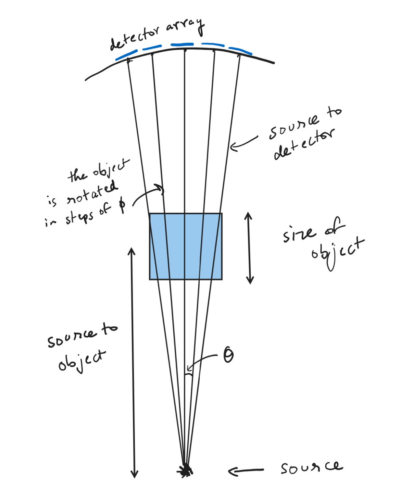

# CT Image reconstruction (2D)

## Problem

Python code to solve a general inverse problem Ax = b. \
For N number of detectors, Size of Object SOJ, 
Distance between Object to Source and Distance between Source to Detector array (center), 
Number of Rotations (of source and detector array), the Code will generate A Matrix by deducing the intercept length 
under a square Pixel using Simple Geometry. 
The detector readings will form b and the solution will form the image.

## Mathematical statement

the problem reduces to
$$A \lambda = d$$
where, $A$ is the matrix containing information about the intercept of x-rays on the material.
$\lambda$ is the flattened image of the material (attenuation constant data), which will be the final output.
$d$ is made using the given intensity $I_o$ of the  radiation source and the intensities observed by the detectors $I$.
Hence, $d$ becomes $$d=\ln(\frac{I_o}{I})$$

## Experiment Geometry

## Code
The code first generates lines corresponding to the path of radiation through the object and then calculates 
intercept of those lines on every pixel.

## References

1. [Original experiment paper](https://www.sciencedirect.com/science/article/pii/S0939388923000880)
2. [Siddon's Algorithm](https://stackoverflow.com/questions/3609382/calculating-the-length-of-intersections-through-a-2d-grid)
